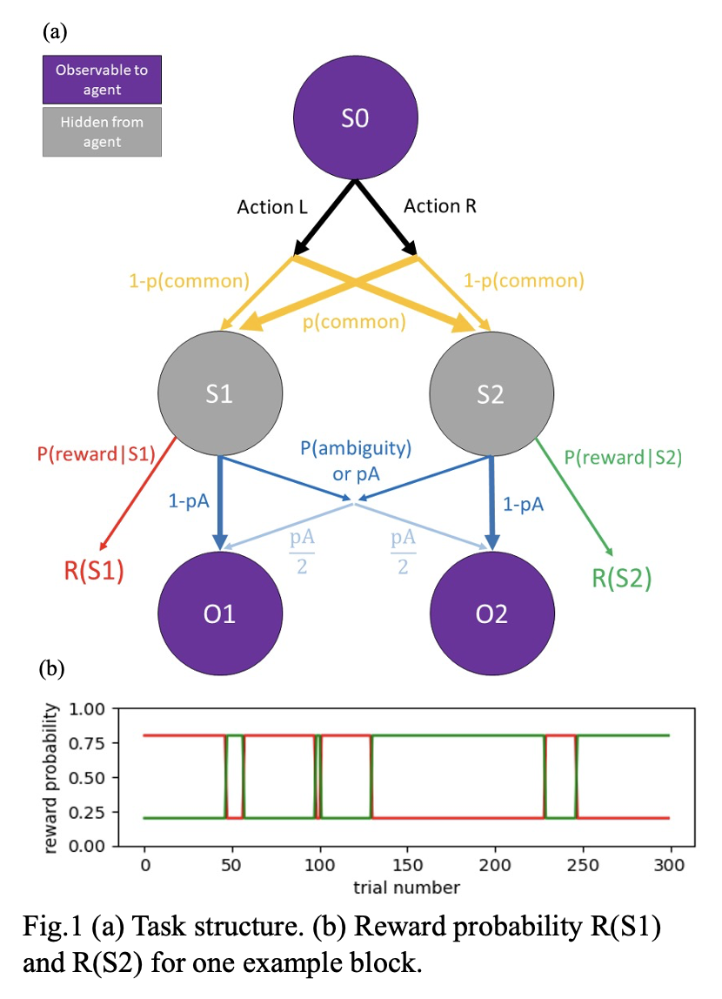

# Two-Step Task RL Model

This repository contains the implementation of the reinforcement learning model based on Daw's Two-Step Task, integrating Long Short-Term Memory (LSTM) units with an Actor-Critic architecture. This model is designed to explore the interaction between model-based (MB) and model-free (MF) reinforcement learning strategies under conditions of varying uncertainty and reward structures.

## Introduction

In reinforcement learning (RL), a fundamental challenge is to balance between exploratory and exploitative actions effectively. The Two-Step Task model by Daw et al. provides a structured framework to investigate how humans and animals balance these strategies. Our implementation extends this by utilizing an LSTM-based neural network, which allows the model to retain information over sequences of actions and states, combined with an Actor-Critic method to effectively learn and optimize decisions based on both current and predicted future states.

## Task and Model Overview

- **Task Description:** Agents decide between two states, influenced by transition probabilities and reward distributions, with the goal of maximizing cumulative rewards.
- **Network Architecture:** Comprises LSTM units paired with an Actor-Critic framework. The actor decides on the action based on the state represented by LSTM outputs, while the critic evaluates the taken action by computing the value function.
- **Training:** The network is trained under varying ambiguity levels and reward conditions to simulate real-world decision-making scenarios.
- **Performance:** Analyzed under different task conditions to measure the efficiency of integrating LSTM with Actor-Critic methods in handling the trade-off between MB and MF reinforcement learning strategies.

## Results

The implemented model demonstrates differential behavior under varied task conditions:
- Performance metrics include reaction times, accuracy, and reward maximization.
- Behavioral results showing the model's adaptability to changing environments and uncertainty levels.

## References

- Akam, T., Costa, R., & Dayan, P. (2015). Simple Plans or Sophisticated Habits? State, Transition and Learning Interactions in the Two-Step Task. *PLoS Computational Biology*, 11(12), 1–25. [https://doi.org/10.1371/journal.pcbi.1004648](https://doi.org/10.1371/journal.pcbi.1004648)
  
- Daw, N. D., Gershman, S. J., Seymour, B., Dayan, P., & Dolan, R. J. (2011). Model-based influences on humans’ choices and striatal prediction errors. *Neuron*, 69(6), 1204–1215. [https://doi.org/10.1016/j.neuron.2011.02.027](https://doi.org/10.1016/j.neuron.2011.02.027)
  
- Kim, D., Park, G. Y., O'Doherty, J. P., & Lee, S. W. (2019). Task complexity interacts with state-space uncertainty in the arbitration between model-based and model-free learning. *Nature Communications*, 10(1). [https://doi.org/10.1038/s41467-019-13632-1](https://doi.org/10.1038/s41467-019-13632-1)
  
- Wang, J. X., Kurth-Nelson, Z., Kumaran, D., Tirumala, D., Soyer, H., Leibo, J. Z., Hassabis, D., & Botvinick, M. (2018). Prefrontal cortex as a meta-reinforcement learning system. *Nature Neuroscience*, 21(6), 860–868. [https://doi.org/10.1038/s41593-018-0147-8](https://doi.org/10.1038/s41593-018-0147-8)
